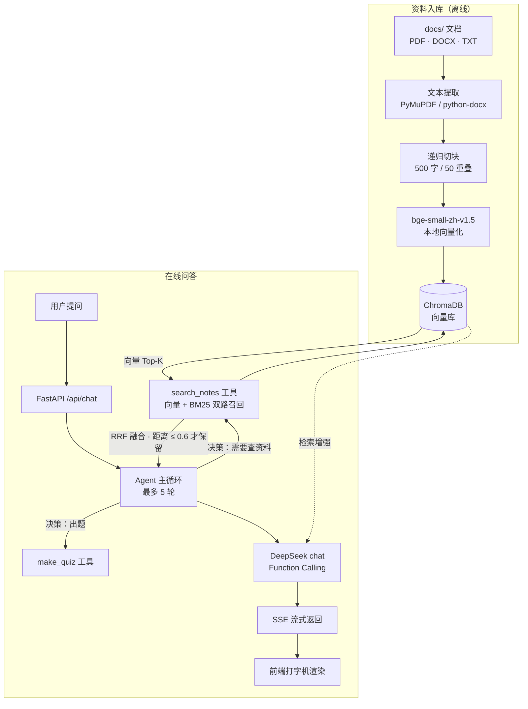

# study-agent · 基于个人学习资料的 AI 学习助手

一个围绕**你自己的学习资料**工作的 AI 助手：把 PDF / Word / 纯文本丢进去，它基于资料内容回答问题、出练习题，并且**资料里没有的内容会明确拒答，不编造**。

RAG 检索与 Agent 工具调用循环均为**手写实现**，未使用 LangChain / LlamaIndex 等框架，便于针对每个环节做针对性调优。

---

## 核心特性

| 特性 | 说明 |
|------|------|
| **基于资料作答** | 提问时 Agent 自动调用检索工具，从本地向量库取回相关片段后再组织回答 |
| **诚实拒答（抗幻觉）** | 双层机制：检索层先按距离阈值（`SEARCH_MAX_DISTANCE=0.6`）滤掉不够相关的片段，模型收到"没有检索到相关内容"而非勉强凑数的资料，再由 System Prompt 约束明确说"资料里没有"，不硬编 |
| **Agent 工具调用** | 手写 Function Calling 循环（最多 5 轮），模型自主决定"要不要查资料、查几次" |
| **流式输出** | SSE 逐 token 推送，前端打字机效果 |
| **过程可观测** | 回答下方展开可看到 Agent 调了哪些工具、拿到什么片段 |
| **出题工具** | 传入主题生成练习题，输出题目 / 答案 / 解析三段式 |
| **多格式资料** | 支持 PDF / DOCX / TXT，支持拖拽上传与目录监听自动入库 |
| **会话持久化** | 对话历史存 SQLite，刷新页面不丢；每设备独立会话 |

---

## 系统架构



**数据流向**：文档 → 文本提取 → 切块 → 向量化 → 存入 ChromaDB；提问时 Agent 判断是否需要检索 → 向量召回与 BM25 关键词召回**双路并行**，经 RRF 融合取 Top-K，再按距离阈值过滤 → 片段拼进上下文 → 大模型基于片段作答 → 流式吐回前端。

---

## 技术选型与理由

| 选型 | 理由 |
|------|------|
| **bge-small-zh-v1.5** | 中文语义检索效果与体积的平衡点（约 90MB），可本地 CPU 运行，无需 GPU 与联网 |
| **ChromaDB** | 轻量级本地向量库，零运维，单机个人项目够用 |
| **混合检索（向量 + BM25）** | 纯向量检索对英文专有名词召回偏弱，自实现零依赖的 BM25 关键词召回补齐，两路结果用 RRF（Reciprocal Rank Fusion）融合——实测把检索命中率从 15/18 提到 17/18 |
| **答案溯源** | Agent 在引用资料内容时自动用 `[来源：xxx.md]` 标注来源文档名，方便用户核查每条事实的出处，是 RAG 区别于"模型自己猜"的核心可验证性 |
| **DeepSeek chat** | 原生支持 Function Calling，成本低（本项目全部评测跑完花费不足 0.1 元） |
| **递归切块 + 兜底分隔符** | 中文按 `。/，/换行` 递归切分；**末尾保留空字符串分隔符做字符级兜底**，避免无标点长文本（压缩代码、长 URL、base64）产生体积失控的巨块撑爆 LLM 请求 |
| **检索距离阈值 0.6** | 纯向量相似度**总会**返回 Top-K 条，"有结果"不等于"相关"。按距离过滤后，资料外的问题在检索层就得到"没有检索到相关内容"的明确信号，模型才有据可依地拒答——这是诚实拒绝率的主要来源，而非仅靠提示词自觉。阈值经 `.env` 可调 |
| **手写 Agent 循环** | 不依赖框架，工具路由、轮数控制、trace 事件完全可控 |
| **SSE 流式** | 相对 WebSocket 更轻量，单向推送场景足够，且实现简单 |

---

## 评测结果

自建评测集 `eval_questions.py`（21 题），覆盖内置示例知识库 `docs/CS-Notes/`（13 份技术笔记：GPT 系列、InstructGPT、OpenMMLab、人体姿态估计、C++、排序算法、费曼学习法等）。其中 18 题答案在资料内、3 题为资料外（用于测试幻觉）。三项指标：

| 指标 | 结果 | 判定方式 |
|------|------|---------|
| **检索命中率** | **17 / 18（94.4%，混合检索）** | Top-5 召回片段中包含答案所在原文 |
| **生成正确率** | **18 / 18（100%）** | 资料内有答案的问题，最终回答命中关键事实 |
| **诚实拒绝率** | **3 / 3（100%）** | 资料外问题正确拒答，而非凭先验知识编造 |

> 检索命中率的优化过程：纯向量检索（bge-small-zh）为 **15/18**，接入 **BM25 关键词召回 + RRF 融合**的混合检索后提升到 **17/18**，见下文说明。

复现方式：

```bash
python eval.py                                            # 检索（向量 vs 混合对比）+ 生成 + 诚实拒绝
python -c "import eval; eval.eval_ablation()"             # 消融实验（量化 RAG 增量）
```

上表为 2026-09-04 本机实测。检索侧为本地向量计算，结果稳定可复现；生成侧依赖 LLM，输出非确定性，复现时个别题目可能有波动。

> **关于检索 94.4% 的诚实说明**：纯向量检索的 3 个漏检（GPT-1 的 Transformer、OpenPose 的"自底向上"、DeepPose 的年份）都源于 bge-small-zh 中文向量模型对**英文专有名词召回偏弱**。接入 BM25 关键词召回补齐后，Transformer、OpenPose 两个漏检被解决。剩余 1 个（DeepPose 年份）是**切块边界问题**——"##### DeepPose 2014"标题被切块器切断，年份与正文分到了不同块，属于切块策略局限，而非检索算法问题（后续可优化标题感知切块）。

> **关于生成 100% 的诚实说明**：CS-Notes 是通用技术知识，模型本身就可能知道这些答案，因此 100% 的正确率不能直接归功于 RAG。为量化 RAG 的真实增量，做了消融实验（同一批 18 题分别走"有检索"和"纯模型"两条链路对比）：

| 链路 | 正确率 |
|------|--------|
| 纯模型（不检索） | 15 / 18 |
| 有检索（完整 RAG） | 18 / 18 |

> 结果：RAG 带来 **+3 题（17%）的增量**，且补上的恰好是模型最容易记错的细节——`map/multimap` 的"重复键"区别、费曼学习法的四个英文单词、选择排序"运行时间与输入无关"的特点。这证明 RAG 的价值不在"模型不会的常识"，而在"模型记不准的精确事实"。

---

## 快速开始

### Docker 部署（推荐）

```bash
python download_model.py     # 首次运行：下载向量模型（约 90MB）
docker compose up --build -d
```

- 前端：http://localhost:5173
- 后端 API 文档：http://localhost:8084/docs

### 本地开发

```bash
pip install -r requirements.txt          # 后端依赖
cd frontend && npm install               # 前端依赖
cp .env.example .env                     # 填入 LLM_API_KEY
python app.py                            # 后端 :8084
cd frontend && npm run dev               # 前端 :5173
```

添加资料：把文档拖进 `docs/`，运行 `python ingest.py` 入库；或 `python watch_docs.py` 监听目录自动入库。

---

## 项目结构

```
study-agent/
├── agent.py            # Agent 大脑：工具定义、工具路由、主循环（最多 5 轮）
├── llm.py              # DeepSeek 接口封装（含流式 + 指数退避重试）
├── tools.py            # 工具实现：search_notes（检索）、make_quiz（出题）
├── app.py              # FastAPI 入口：登录鉴权、SSE 流式对话、文件上传、历史记录
├── db.py               # SQLite：建表、存消息、读历史
├── ingest.py           # 资料入库流水线
├── eval.py             # 评测：检索命中率 / 生成正确率 / 诚实拒绝率
├── eval_questions.py   # 评测集（21 题）
├── rag/
│   ├── loader.py       # 多格式文本提取
│   ├── chunker.py      # 递归切块（含字符级兜底）
│   └── store.py        # ChromaDB 增删查 + 混合检索（向量+BM25，RRF 融合）
│   └── bm25.py         # 零依赖 BM25 关键词检索 + RRF
└── frontend/           # Vue 3 + Vite 前端
```

---

## 已知限制

- **扫描版 PDF 不支持**：无文字层的影印版 PDF 提取不到文本（当前会提示 0 块），需要接入 OCR 才能处理
- **评测集规模偏小**：21 题，尚不足以反映复杂场景下的真实表现
- **无重排（Rerank）**：混合检索已补齐关键词召回，但两路结果仅用 RRF 融合、未做交叉编码器重排，相关性排序仍有提升空间
- **切块边界粗糙**：标题行（如"##### DeepPose 2014"）可能被切断，年份与正文分到不同块，影响个别查询的召回
- **单用户**：当前为密码 + 令牌鉴权，无多用户账号体系
- **令牌存内存**：服务重启后所有登录态失效，生产环境需换持久化方案

---

## Roadmap

- [ ] **OCR 支持**：接入 PaddleOCR / RapidOCR，让扫描版教材也能入库
- [ ] **Rerank 重排**：在混合检索之上加交叉编码器（如 bge-reranker）重排，用评测集量化提升
- [ ] **标题感知切块**：避免标题行被切断，解决"DeepPose 2014 年份与正文分离"类召回问题
- [ ] **扩充评测集**：50+ 题，覆盖多跳推理、同义改写、干扰项；用 LLM-as-judge 替代关键词匹配判定幻觉
- [ ] **多步推理 Agent**：支持需要多次检索才能回答的复合问题
- [ ] **上下文管理**：长对话压缩、token 用量统计与成本展示

---

## 技术栈

Python · FastAPI · Vue 3 · Vite · ChromaDB · sentence-transformers · SQLite · Docker · DeepSeek API
