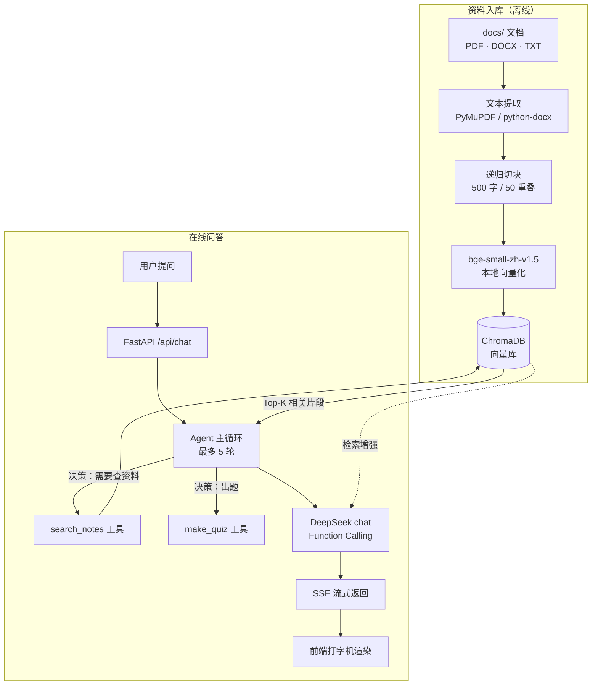

# study-agent · 基于个人学习资料的 AI 学习助手

一个围绕**你自己的学习资料**工作的 AI 助手：把 PDF / Word / 纯文本丢进去，它基于资料内容回答问题、出练习题，并且**资料里没有的内容会明确拒答，不编造**。

RAG 检索与 Agent 工具调用循环均为**手写实现**，未使用 LangChain / LlamaIndex 等框架，便于针对每个环节做针对性调优。

---

## 核心特性

| 特性 | 说明 |
|------|------|
| **基于资料作答** | 提问时 Agent 自动调用检索工具，从本地向量库取回相关片段后再组织回答 |
| **诚实拒答（抗幻觉）** | 通过 System Prompt 约束 + 评测集验证：资料外的问题明确说"资料里没有"，不硬编 |
| **Agent 工具调用** | 手写 Function Calling 循环（最多 5 轮），模型自主决定"要不要查资料、查几次" |
| **流式输出** | SSE 逐 token 推送，前端打字机效果 |
| **过程可观测** | 回答下方展开可看到 Agent 调了哪些工具、拿到什么片段 |
| **出题工具** | 传入主题生成练习题，输出题目 / 答案 / 解析三段式 |
| **多格式资料** | 支持 PDF / DOCX / TXT，支持拖拽上传与目录监听自动入库 |
| **会话持久化** | 对话历史存 SQLite，刷新页面不丢；每设备独立会话 |

---

## 系统架构



**数据流向**：文档 → 文本提取 → 切块 → 向量化 → 存入 ChromaDB；提问时 Agent 判断是否需要检索 → 取回片段拼进上下文 → 大模型基于片段作答 → 流式吐回前端。

---

## 技术选型与理由

| 选型 | 理由 |
|------|------|
| **bge-small-zh-v1.5** | 中文语义检索效果与体积的平衡点（约 90MB），可本地 CPU 运行，无需 GPU 与联网 |
| **ChromaDB** | 轻量级本地向量库，零运维，单机个人项目够用 |
| **DeepSeek chat** | 原生支持 Function Calling，成本低（本项目全部评测跑完花费不足 0.1 元） |
| **递归切块 + 兜底分隔符** | 中文按 `。/，/换行` 递归切分；**末尾保留空字符串分隔符做字符级兜底**，避免无标点长文本（压缩代码、长 URL、base64）产生体积失控的巨块撑爆 LLM 请求 |
| **手写 Agent 循环** | 不依赖框架，工具路由、轮数控制、trace 事件完全可控 |
| **SSE 流式** | 相对 WebSocket 更轻量，单向推送场景足够，且实现简单 |

---

## 评测结果

自建评测集 `eval_questions.py`（16 题），其中 13 题答案在资料内、3 题为资料外（用于测试幻觉）。三项指标：

| 指标 | 结果 | 判定方式 |
|------|------|---------|
| **检索命中率** | **13 / 13（100%）** | Top-5 召回片段中包含答案所在原文 |
| **生成正确率** | **13 / 13（100%）** | 资料内有答案的问题，最终回答命中关键事实 |
| **诚实拒绝率** | **3 / 3（100%）** | 资料外问题正确拒答，而非凭先验知识编造 |

复现方式：

```bash
python eval.py
```

> **关于这份数据的诚实说明**：当前评测集仅 16 题，且以事实型单跳问答为主，属于**功能验证级别**，100% 的结果更多说明"链路正确"而非"效果卓越"。评测集规模与难度是衡量 RAG 系统的关键，后续计划扩充到 50+ 题，并加入多跳推理、同义改写、干扰项等更具区分度的用例（见 Roadmap）。

---

## 快速开始

### Docker 部署（推荐）

```bash
python download_model.py     # 首次运行：下载向量模型（约 90MB）
docker compose up --build -d
```

- 前端：http://localhost:5173
- 后端 API 文档：http://localhost:8084/docs

### 本地开发

```bash
pip install -r requirements.txt          # 后端依赖
cd frontend && npm install               # 前端依赖
cp .env.example .env                     # 填入 LLM_API_KEY
python app.py                            # 后端 :8084
cd frontend && npm run dev               # 前端 :5173
```

添加资料：把文档拖进 `docs/`，运行 `python ingest.py` 入库；或 `python watch_docs.py` 监听目录自动入库。

---

## 项目结构

```
study-agent/
├── agent.py            # Agent 大脑：工具定义、工具路由、主循环（最多 5 轮）
├── llm.py              # DeepSeek 接口封装（含流式 + 指数退避重试）
├── tools.py            # 工具实现：search_notes（检索）、make_quiz（出题）
├── app.py              # FastAPI 入口：登录鉴权、SSE 流式对话、文件上传、历史记录
├── db.py               # SQLite：建表、存消息、读历史
├── ingest.py           # 资料入库流水线
├── eval.py             # 评测：检索命中率 / 生成正确率 / 诚实拒绝率
├── eval_questions.py   # 评测集（16 题）
├── rag/
│   ├── loader.py       # 多格式文本提取
│   ├── chunker.py      # 递归切块（含字符级兜底）
│   └── store.py        # ChromaDB 增删查
└── frontend/           # Vue 3 + Vite 前端
```

---

## 已知限制

- **扫描版 PDF 不支持**：无文字层的影印版 PDF 提取不到文本（当前会提示 0 块），需要接入 OCR 才能处理
- **评测集规模偏小**：16 题，尚不足以反映复杂场景下的真实表现
- **检索为纯向量相似度**：未做关键词召回（BM25）与重排（Rerank），专有名词类查询的召回仍有提升空间
- **单用户**：当前为密码 + 令牌鉴权，无多用户账号体系
- **令牌存内存**：服务重启后所有登录态失效，生产环境需换持久化方案

---

## Roadmap

- [ ] **OCR 支持**：接入 PaddleOCR / RapidOCR，让扫描版教材也能入库
- [ ] **混合检索 + Rerank**：BM25 关键词召回 + 向量召回双路，再用 reranker 重排，用评测集量化提升
- [ ] **答案溯源**：回答中标注引用来源（文档名 + 片段位置），提升可信度与可核查性
- [ ] **扩充评测集**：50+ 题，覆盖多跳推理、同义改写、干扰项；用 LLM-as-judge 替代关键词匹配判定幻觉
- [ ] **多步推理 Agent**：支持需要多次检索才能回答的复合问题
- [ ] **上下文管理**：长对话压缩、token 用量统计与成本展示

---

## 技术栈

Python · FastAPI · Vue 3 · Vite · ChromaDB · sentence-transformers · SQLite · Docker · DeepSeek API
